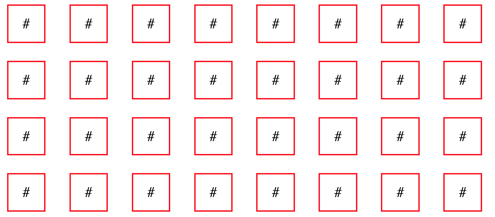
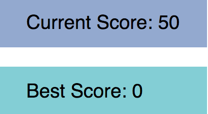

### [Live](http://www.dongjinxu.com/MemoryGame/)

# MemoryGame

MemoryGame is a card game in which all of the cards are laid face down on a surface and two cards are flipped face up over each turn. The object of the game is to turn over pairs of matching cards. It aims to practice and reinforce memory skills.

MemoryGame is built upon React.js.

## Getting Started
Clone or Download this repo to your local environment. Set up initial npm and webpack. Open index.html in the browser.

## Features & Implementation

### Flipping Card
MemoryGame has a board of cards to play with. Clicking on a hidden value card will flip it up. Its value will be shown to the player. Player can only flip two cards in one round. If these cards are matched in value, they will be visible, otherwise, they will be flipped back to be invisible again.



```
makeGuess(pos){
  if (!this.state.board[pos[0]][pos[1]].revealed){
    if (this.state.firstPos === null){
      this.state.board[pos[0]][pos[1]].revealed = true;
      this.setState({noMatch: false, board: this.state.board, firstPos: pos});
    } else {
      this.state.board[pos[0]][pos[1]].revealed = true;
      if (this.compare(pos)){
        this.setState({currScore: this.state.currScore + 5, noMatch: false, board: this.state.board, firstPos: null});
      } else {
        this.setState({noMatch: true, board: this.state.board, secondPos: pos});
      }
    }
    if (this.state.noMatch){
      this.state.board[this.state.firstPos[0]][this.state.firstPos[1]].revealed = false;
      this.state.board[this.state.secondPos[0]][this.state.secondPos[1]].revealed = false;
      this.setState({currScore: this.state.currScore - 3, noMatch: false, board: this.state.board, firstPos: pos, secondPos: null});
    }
  }
}
```

### Tracking Score
MemoryGame has a tracking score platform that current score and best score will be kept tracked of. Once current player's current score is below 0, this game is over, and player loses. Otherwise, if current player flips all the cards up and it's still within time limit, this player wins and best score is updated if needed.



```
this.state.bestScore = this.state.bestScore > this.state.currScore ? this.state.bestScore : this.state.currScore;

```
### Difficulty Level
MemoryGame has difficulty level to be chosen. Each difficulty level represents different amount of cards that will be present. Players can choose the level as they desire.


```
case 1:
  this.setState({
    size: 6,
    firstPos: null,
    secondPos: null,
    board: populate(6)
  });
  break;
```

### Reset Button
Player can reset the game anytime they want. RESET will reset the best score to be 0.

```
this.setState({size: this.props.game.size,
  firstPos: null,
  secondPos: null,
  board: populate(this.props.game.size),
  currScore: 50,
  bestScore: 0
});
```

### Countdown Timer
MemoryGame has a countdown timer as another challenge in the game. If timer is running out of time and there are cards left in the board, current player loses.


```
componentDidMount() {
  this.countDown();
  this.setState({ time: this.convert(this.state.seconds)});
  if (this.timer === 0) {
    this.timer = setInterval(this.countDown, 1000);
  }
}
```

## Built With
[React.js](https://reactjs.org/) - frontend JS library
